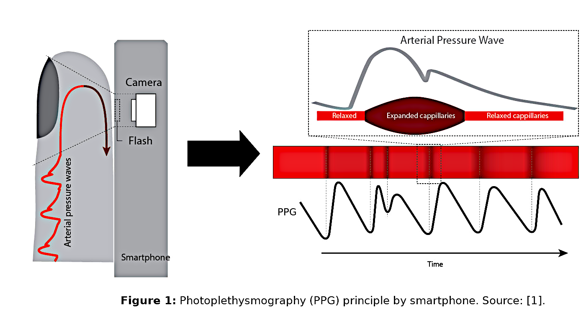
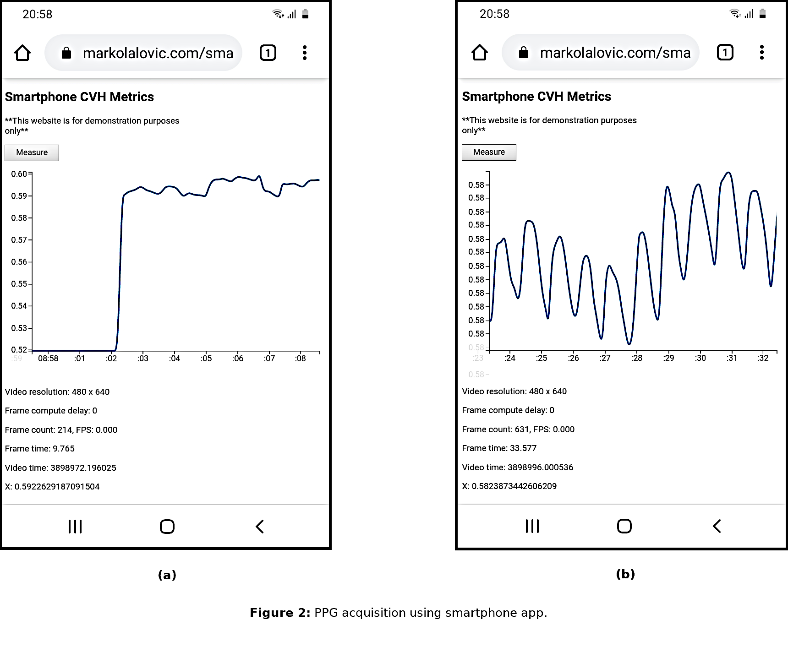

# ppg-vitals

Demo app designed to demonstrate that a smart phone camera can be used to estimate several cardiovascular metrics:

[https://markolalovic.com/smartphone-cvh-metrics/](https://markolalovic.com/smartphone-cvh-metrics/)

## Description

The application uses the smart phone flashlight and camera to measure photoplethysmogram (PPG) by capturing the color intensity changes in the fingertip as shown in **Figure 1**. With improved lenses and ability to capture video at high rates (approaching the clinical pulse-oximeter at 100 Hz), smart phones are getting more capable of acquiring PPG signal. Although they have been successfully used to determine heart rate, to estimate blood pressure or blood glucose level, the acquired signal needs to be substantially better. This application is created to test some methodology of cleaning the acquired noisy signals so the above-mentioned cardiovascular metrics can be estimated.

## Instructions For Using the Application

- Visit: [applications website](https://markolalovic.com/smartphone-cvh-metrics/)
 from your smart phone.
- Place the smart phone in the palm of your hand and press the `Measure` button; see **Figure 2 (a)**.
- Cover both the camera and the flashlight with your finger as shown in **Figure 1**.
- In case the signal doesn't look periodic as in **Figure 2 (b)** you can:
    - Try applying less finger pressure on the lens of the camera;
    - Try to be still without moving the finger;
    - Try to be calm without rapid breathing;
    - Be patient and wait for the graph to shift to the new values.

## TODO
- Fix the video resolution and frame rate.
- Determine the signal quality.
- Send, evaluate and show results for:
    - Resting heart rate;
    - Resting blood pressure;
    - Blood glucose level;
- Add contribute button.

## References
[1]: Vandenberk T, Stans J, Mortelmans C, Van Haelst R, Van Schelvergem G, Pelckmans C, Smeets C, Lanssens D, De Cannière H, Storms V, Thijs I, Vaes B, Vandervoort P
Clinical Validation of Heart Rate Apps: Mixed-Methods Evaluation Study
JMIR Mhealth Uhealth 2017;5(8):e129
[https://mhealth.jmir.org/2017/8/e129](https://mhealth.jmir.org/2017/8/e129)
